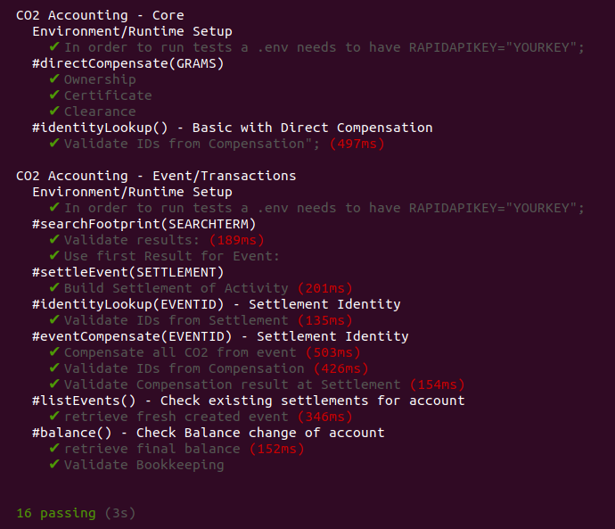

# co2accounting
<a href="https://stromdao.de/" target="_blank" title="STROMDAO - Digital Energy Infrastructure"></a>

**GHG accounting and decompensation in accordance to ISO14064-3 using [CO2 Offset API](https://co2offset.io/)**

[](https://co2offset.io/badge.html?host=npm-co2accounting)[](https://www.npmjs.org/package/co2accounting)
[](https://npmcharts.com/compare/co2accounting?minimal=true)

## Installation

Use the package manager [npm](https://www.npmjs.com/) to install co2accounting.

### from shell

```bash
npm install --g co2accounting
```

### as a module

```bash
npm install --save co2accounting
cp sample.env .env
```

Edit the .env and set your RapidAPI-Key.

### via source

Checkout source code from GIT and install dependencies

```bash
git clone https://github.com/energychain/co2accounting-rapidapi.git
cd co2accounting-rapidapi
npm install
```

## Usage

### Use as command line tool (CLI)

In order to script and/or include `co2accounting` a simple CLI-Interface is available. However, you might want to extend/modify the cli.js to fit to your particular needs.

#### Installation
```bash
npm install -g --save co2accounting
co2accounting -h
```

| Command | Description |
|---------|-------------|
| `whoami`  | Gives your Account Id |
| `compensate [options] <grams>` | Direct compensate given number grams or CO2 |
| `compensateEvent [options] <eventId>` | Compensate remaing emission of an event |
| `emission [options] <grams>` | Add emission to account. |
| `balance [options]` | Retrieves CO2 Accounting Balance |
| `footprint [options] <searchTerm>` | Searches in Footprint database |
| `events [options]` | Retrieves emission events |
| `identity [options] <account>` | Retrieves Nature and Details of given identity |
| `help [command]` | display help for command |

### Use as module (in your code)

The main usage of `co2accounting` is from within your code as node module. Best reference are the [test cases](./test).  

```javascript
const CO2Accounting = require('co2accounting');

const instance = new CO2Accounting('INSERT-RAPIDAPI-KEY');

console.log(await instance.whoami());
```

Try on this on [RunKit](https://runkit.com/zoernert/co2accounting-whoami-hello-world).


## Tests

Checkout source code first and install dependencies.

Create a `.env` file containing your RapidAPI Key [Retrieve/Signup](https://rapidapi.com/stromdao-stromdao-default/api/co2-offset).

```
RAPIDAPIKEY=YOURAPIKEY-GOES-HERE
```

Run tests

```bash
npm test
```

### Expected Results


## Contributing

Pull requests are welcome. For major changes, please open an issue first to discuss what you would like to change. Please make sure to update tests as appropriate. Details on [contributing](./CONTRIBUTING.md).

## Maintainer / Imprint

<addr>
STROMDAO GmbH  <br/>
Gerhard Weiser Ring 29  <br/>
69256 Mauer  <br/>
Germany  <br/>
  <br/>
+49 6226 968 009 0  <br/>
  <br/>
kontakt@stromdao.com  <br/>
  <br/>
Handelsregister: HRB 728691 (Amtsgericht Mannheim)
</addr>

Project Website: https://co2offset.io/

## LICENSE
[Apache-2.0](./LICENSE)
